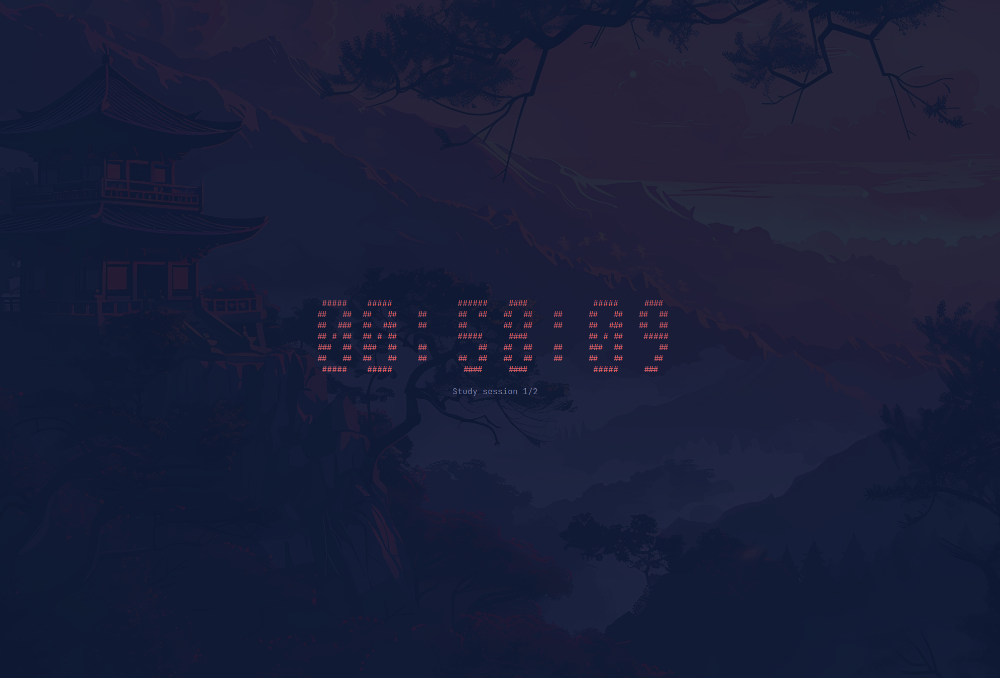

# Commad Line Pomodoro Timer

A simple command line application that creates a **pomodoro timer** through user inputted timing. 

Stack
- Python
- Timer (python package to display timer in command line)
- Pyfiglet
- SQLite 



---

## Functionality
1. Takes user inputted study time, break time, and session count.
2. Automatically goes through the sessions, alternating between study and breaks.
3. Shows how many sessinos have been completed under the timer.
4. Cool ascii art after you have finished all your sessions. 
5. Logs date and amount of time studied into an SQLite database, a line plot of which can be viewed by the user.

---

## Usage
```
Flags: [-h] [-s STUDY] [-r REST] [-ss SESSIONS] [-rr] [-g]

-h, --help            show this help message and exit
-s, --study STUDY     the amount of study time in minutes (required)
-r, --rest REST       the amount of rest time in minutes (required)
-ss, --sessions SESSIONS
                    the number of sessions (required)
-l, --log             logs the session once completed
-g, --graph           shows a graph of date and study time, must be passed alone
```

---

## Local Setup

### Clone the Repo
```
bash git clone https://github.com/aatif-dawawala/command-line-pomodoro
cd command-line-pomodoro
```

### Install Dependencies
```pip install -r requirements.txt```

### Run Locally
```python main.py```

## License
MIT

## Contributing
Pull requests are welcome. I would love any feature ideas as well!